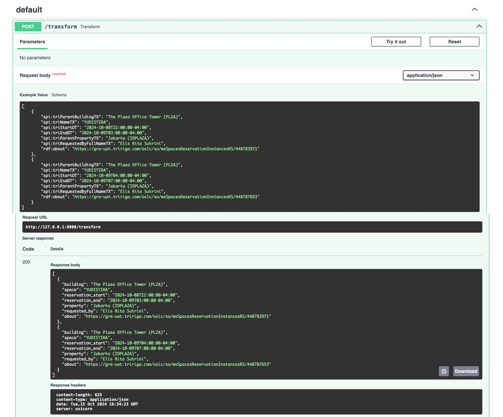

# Using Pydantic to Solve a Work Problem

When I call an API in Watson Assistant, my response is in the following JSON format. Notice the `spi:` namespace in front of every field. SpEL expression language in Watson Assistant cannot reconcile `:`.

```json
[
    {
        "spi:triParentBuildingTX": "The Plaza Office Tower (PLZA)",
        "spi:triNameTX": "YUDISTIRA",
        "spi:triStartDT": "2024-10-08T22:00:00-04:00",
        "spi:triEndDT": "2024-10-09T03:00:00-04:00",
        "spi:triParentPropertyTX": "Jakarta (IDPLAZA)",
        "spi:triRequestedByFullNameTX": "Elis Rita Sutrini",
        "rdf:about": "https://gre-uat.tririga.com/oslc/so/wxSpacesReservationInstancesRS/448783971"
    },
    {
        "spi:triParentBuildingTX": "The Plaza Office Tower (PLZA)",
        "spi:triNameTX": "YUDISTIRA",
        "spi:triStartDT": "2024-10-09T04:00:00-04:00",
        "spi:triEndDT": "2024-10-09T07:00:00-04:00",
        "spi:triParentPropertyTX": "Jakarta (IDPLAZA)",
        "spi:triRequestedByFullNameTX": "Elis Rita Sutrini",
        "rdf:about": "https://gre-uat.tririga.com/oslc/so/wxSpacesReservationInstancesRS/448787653"
    }
]
```

I have to use code and write a custom API to rename the fields and feed it back to Watson Assistant to use.

I accidentally found a solution that can be solved by Pydantic and FastAPI.

## Usage

1. Navigate to pydantic_tutorial folder
2. Type `spi_pydantic_model:app --reload`

## Example Response


